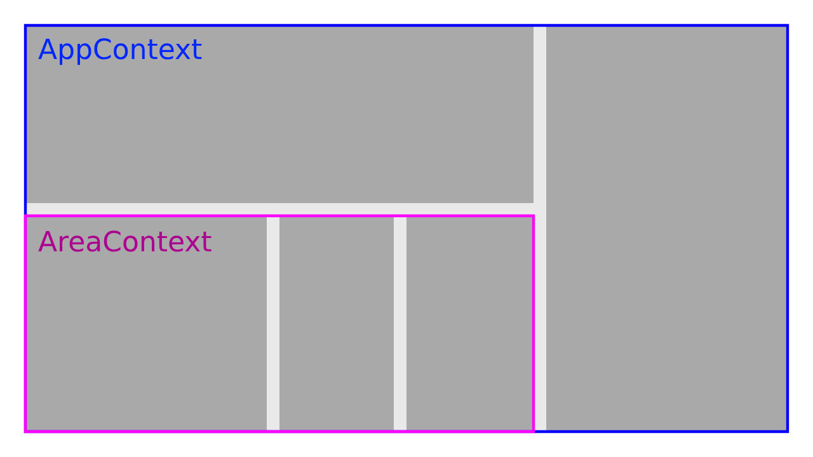

After several years of using Redux for most of our projects we decided to try useReducer/useContext approach instead. Here is what we learned.

---
## TL;DR

Using Hooks instead of Redux for state management is by no means _easier_. 

You have to be already familiar with the underlying concepts and understand the tradeoffs. Without relying on Redux you lose out-of-the-box performance optimizations, middleware support, devtools extension, time travel debugging and a bunch of [other](https://medium.com/@dan_abramov/you-might-not-need-redux-be46360cf367) things.

On the other hand you can noticeably reduce boilerplate and make iterations faster.

---

## Why it worked for us

Before we go into details about "how" let's focus on the question "why". We decided to take this route because our project had very specific requirements. 

- Middle-sized project
- Tight deadline
- Small global state with infrequent updates
- TypeScript everywhere
- No server-side rendering

Mark Erikson, one of the maintainers of Redux, recently did a great talk called "[The State of Redux](http://www.youtube.com/watch?v=mtjHxwUQUs0&t=54m17s)" in which he addressed some of the myths and misconceptions about Redux. He also mentions when it makes sense to use alternative solutions. I highly suggest watching it before you decide on this path.

---

## Global namespace

Having a single store in Redux comes with [benefits](https://stackoverflow.com/a/33633850/1936347), but at the  same time you end up putting everything into global namespace. Most applications profit from this, you can even [create nested reducers](https://kickstarter.engineering/namespacing-actions-for-redux-d9b55a88b1b1) and use naming conventions for actions. But if your global state is small and you know for sure that specific slices of state will only be used by specific areas of your application, making them global makes you feel.. uneasy. 

Instead, when using Hooks we can leverage the power of useReducer/useContext combination to create multiple "stores" for different areas of our application.  This goes more in the direction of MobX and state management solutions inspired by Flux architecture. We are essentially creating multiple large [compound components](https://kentcdodds.com/blog/compound-components-with-react-hooks/). 

This is what it looks like visualized with my crazy Paint skills.



Here is an example Provider which makes `state` object and `dispatch` function accessible to all the child components. This way they have access to all the data from our store and can dispatch actions to manipulate this data.

```typescript
type Context = {
  state: ArticleSearchState;
  dispatch: Dispatch<Action>;
}

const ArticleSearchContext = createContext({} as Context);

function useArticleSearchContext() {
  return useContext(ArticleSearchContext);
}

const ArticleSearch = () => {
  const [state, dispatch] = useReducer(reducer, initialState);

  return <ArticleSearchContext.Provider value={{ state, dispatch }}>
    ...
  </ArticleSearchContext.Provider>;
};
```

We can consume multiple contexts using `useContext` or custom hooks we created. As you see, we don't need any higher order components like `connect` or render prop patterns.

```typescript
const ArticleSearchSidebar = () => {
  const { categories } = useAppContext();
  const { state, dispatch } = useArticleSearchContext();

  ...
}
```

---

## TypeScript

As TypeScript gains more and more adoption we often have to ask ourselves: "Does this work well with TS?"

Using TypeScript with Redux is by no means an easy task. Suddenly realizing that the component you are working on needs to be `connected` often results in a frustrated "sigh". There are multiple different [approaches](https://github.com/piotrwitek/react-redux-typescript-guide) and [libraries](https://github.com/aikoven/typescript-fsa) available with different levels of complexity, flexibility and amounts of boilerplate code. 

Hooks on the other hand are very pleasant to use with TypeScript. Here we see [discriminated unions](https://basarat.gitbooks.io/typescript/docs/types/discriminated-unions.html) used to create typed actions and a reducer. The `produce` part is coming from [immer](https://github.com/mweststrate/immer) and makes working with immutable updates much easier.

```typescript
type Action =
  { type: 'ADD_MENU', payload: Menu }
  | { type: 'DELETE_MENU', payload: { menuId: number, folderId: number } };

type OverviewState = {
  folders: Array<MenuFolder>;
  selectedFolderId?: number;
};

function reducer(state: OverviewState, action: Action): OverviewState {
  switch (action.type) {

    case 'DELETE_MENU': {
      const { folderId, menuId } = action.payload;

      return produce(state, draft => {
        const folder = draft.folders.find(f => f.id === folderId);

        if (folder && folder.menus) {
          const menuIndex = folder.menus.findIndex(m => m.id === menuId);
          // Mutate all you want, it's the power of immer
          folder.menus.splice(menuIndex, 1);
        }
      });
    }

    case 'ADD_MENU': {
      const folderId = state.selectedFolderId;

      return produce(state, draft => {
        const folder = draft.folders.find(f => f.id === folderId) || {};
        folder.menus && folder.menus.push(action.payload);
      });
    }

    default:
      return state;
  }
}
```

In fact, we can go even further on our quest to reduce boilerplate and install [use-methods](https://github.com/pelotom/use-methods) library, which is built on top of `useReducer`, already uses immer **under the hood** and negates the need for explicit action types. Incredible stuff.

Here is the same example, rewritten using use-methods.

```typescript
type OverviewState = {
  folders: Array<MenuFolder>;
  selectedFolderId?: number;
};

const methods = (state: OverviewState) => ({
  deleteMenu({ folderId, menuId }: { menuId: number, folderId: number }) {
    const folder = state.folders.find(f => f.id === folderId);

    if (folder && folder.menus) {
      const menuIndex = folder.menus.findIndex(m => m.id === menuId);
      folder.menus.splice(menuIndex, 1);
    }
  },
  addMenu(menu: Menu) {
    const folderId = state.selectedFolderId;
    const folder = state.folders.find(f => f.id === folderId) || {};
    folder.menus && folder.menus.push(menu);
  },
});
```

For more information on React usage with TypeScript refer to this [cheatsheet](https://github.com/sw-yx/react-typescript-cheatsheet).

---

## Performance 

React-redux  implements [complex performance optimizations](https://redux.js.org/faq/react-redux#why-should-i-use-react-redux) for you. Your connected components won't be rerendered unless there are changes in the state slice they are depending on.

`useContext`, on the other hand, [doesn't let you subscribe](https://github.com/facebook/react/issues/14110) to a part of the context value without fully re-rendering. It means `useContext` will always re-render every connected component regardless of that component caring about that change or not.

Most of the time this is not an issue because re-rendering components in React is actually really cheap. The problems arise when there are large amounts of elements being re-rendered or store updates happen really frequently, for example because of textarea state change or some drag-and-drop.

**So, what if you start experiencing rendering performance problems?**

1. Walk through empty streets and reflect on your decision to ditch Redux. 
2. [Profile](https://www.youtube.com/watch?v=iTrCNz1gRt0) and determine what exactly causes the problem. 

`youtube:https://www.youtube.com/embed/iTrCNz1gRt0`

3. Optimize.

The `Editor` component in the code example below will still be executed, but the JSX part won't be re-rendered unless some of the dependencies passed to `useMemo` change.

```javascript
function Editor() {
  const { state } = useAppContext();

  const selectedPost = state.posts.find(e => e.id === state.selectedPostId) || {};

  // highlight-next-line
  return useMemo(() => {
    return <ExpensiveTree>
      <StyledEditor>
        ...
      </StyledEditor>
    </ExpensiveTree>;
  // highlight-next-line
  }, [selectedPost.body, state.noDisturb]);
}
```

Another solution would be to split component into two and wrap it with `memo`, but I like the above approach more because you avoid creating unnecessary components. Take a look at this [comment from Dan Abramov](https://github.com/facebook/react/issues/15156#issuecomment-474590693) for more information on this topic. 

---

## Selectors

Selectors allow us to efficiently compute derived data from the store and can be composed on top of each other. We can mostly replicate this behaviour using hooks, but this approach is [not meant to completely replace](https://github.com/reduxjs/reselect/issues/386) a library like reselect for example, because it only works on a component level.  

```javascript
function useFilteredArticles() {
  const { articles, filters } = useAppContext();
  
  const filteredArticles = useMemo(
    () => filterArticles(articles, filters),
    [articles, filters]
  );
  
  return filteredArticles;
}

function ArticleList() {
  const filteredArticles = useFilteredArticles();
  
  ...
}
```

---

## Middleware

There is currently no possibility to do something like this:
 
```javascript
applyMiddleware(useReducer, [logging, thunks, ...]);
``` 

And probably won't ever be, because that's [not what `useReducer` was designed for](https://twitter.com/dan_abramov/status/1098928616698728449).

So we did data fetching with [`useEffect`](https://overreacted.io/a-complete-guide-to-useeffect/) and also created a custom [`useReducerWithLogger`](https://staleclosures.dev/building-usereducer-with-logger/) as a replacement for redux-logger.

```javascript
function enchanceDispatchWithLogger(dispatch) {
  return function (action) {
    console.groupCollapsed('Action Type:', action.type);
    return dispatch(action);
  }
}

function useReducerWithLogger(...args) {
  let prevState = useRef(initialState);
  const [state, dispatch] = useReducer(...args);

  const dispatchWithLogger = useMemo(() => {
    return enchanceDispatchWithLogger(dispatch);
  }, [dispatch]);

  useEffect(() => {
    if (state !== initialState) {
      console.log('Prev state: ', prevState.current);
      console.log('Next state: ', state);
      console.groupEnd();
    }
    prevState.current = state;
  }, [state]);


  return [state, dispatchWithLogger];
}

function App() {
  const [state, dispatch] = useReducerWithLogger(reducer, initialState);
  
  ...
}
```

---

## Devtools & time travel debugging

Time travel debugging is one of those features that creates an immediate "wow" effect, but you rarely end up using it for actual work. Nevertheless, there is a new project called [react-rewind](https://github.com/reactrewind/react-rewind) which tries to replicate this functionality for `useReducer`.


---

## With future in mind

Concurrent React and Suspense are coming and raise a whole bunch of questions. Will current state management solutions work the same way as before? Will something break? Redux is not maintained by the React core team, so we are kinda in the dark here. 

Mark Erikson himself told that they don't have enough information right now and will worry about it when Suspense/Concurrent Mode come out.

With hooks, on the other hand, we at least can be sure that React team "has our back covered".

---

## Let's recap 

- It works only for specific types of applications
- You *have* to understand what you're doing
- Optimizing rendering performance is now *your* job
- Typescript works great
- We were able to ship faster

---

[Discuss on Twitter](https://twitter.com/latviancoder/status/1114485719307825153) | [Edit this post on Github](https://github.com/latviancoder/staleclosures.dev/edit/master/src/pages/from-redux-to-hooks-case-study/index.md)
