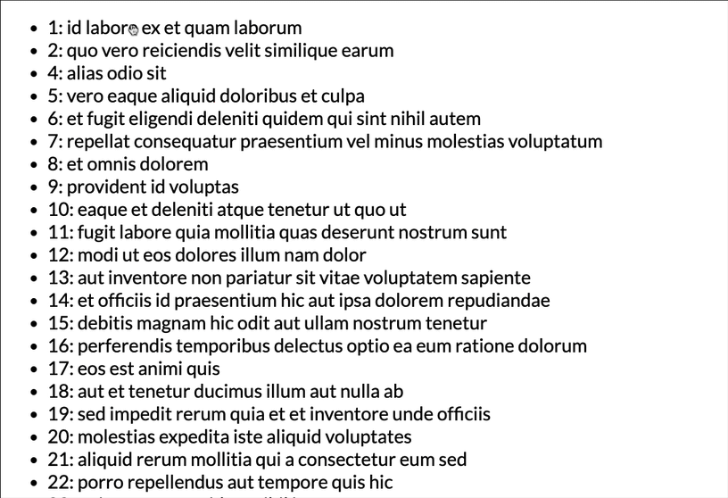
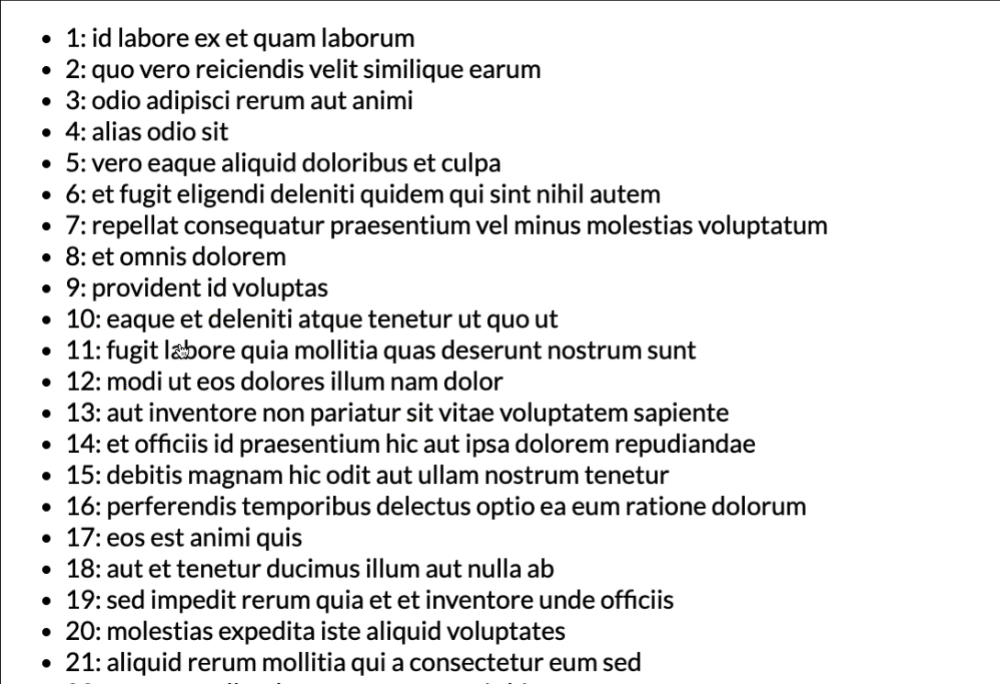
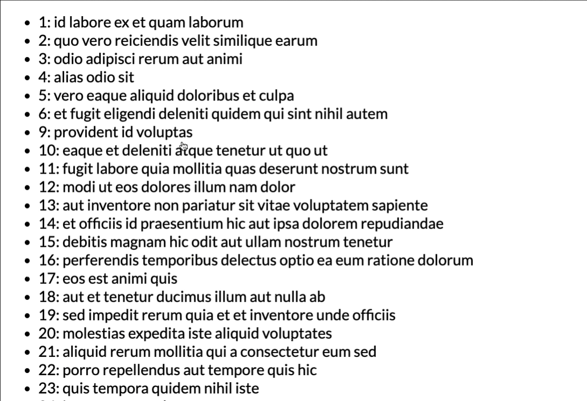

Take a look at [this codesandbox demo](https://codesandbox.io/s/j3kpk0pzxy). We've got a list of items and we delete on of them when clicked. It works fine, but has one minor problem.

If we open React DevTools, go to Settings and enable "Highlight updates", this is what we are going to see.



Every time we delete one of the items the whole list is getting re-rendered. And it makes total sense, because that's how React works. When parent components' state changes React will recursively re-render all of its children. Unless we tell him no to.

How exactly? For class components we had `shouldComponentUpdate` and `PureComponent`, for function components we can use [`memo`](https://reactjs.org/docs/react-api.html#reactmemo). React will shallowly compare props and skip rendering if they stayed the same.

```jsx
// highlight-next-line
const Comment = memo(({ name, id, onClick }) => {
  return (
    <li onClick={() => onClick(id)}>
      {id}: {name}
    </li>
  );
// highlight-next-line
});
```

And that's it, right? Nope, we are still re-rendering everything. Function components are full of surprises. And that's not exactly React fault, that's just how functions in JavaScript  work.

Let's take a look at our `App` component. 

- Click happens 
- `handleChange` executes 
- State updates, causes re-render
- `App` function is called 
- New function is created and assigned to `handleChange` variable
- `handleChange` gets passed to `Comment` component

And that's where the `memo` comparison chokes. We create new function on every render. But the thing is, even if two functions in JavaScript look exactly the same, they aren't. You can check it in your browser console.

```javascript
const one = function() {}
const two = function() {}
one === two
// false
```

But no worries, React team has our back covered. [`useCallback`](https://reactjs.org/docs/hooks-reference.html#usecallback) comes to the rescue.

> useCallback will return a memoized version of the callback that only changes if one of the dependencies has changed. This is useful when passing callbacks to optimized child components that rely on reference equality to prevent unnecessary renders.

Alright, think we've got it. Just wrap our `handleClick` function and don't specify any dependencies.

```typescript
const handleClick = useCallback(id => {
  setComments(comments.filter(c => c.id !== id));
}, []);
```

Aaand we've just created a [stale closure](https://glitteringglobofwisdom.com/cleaning-up-stale-useeffect-closures-in-react-hooks/), which again has nothing to do with React. Because we didn't include `comments` in our dependency list this variable will always contain it's initial value `[]` inside the closure. So after click the whole list will simply disappear.

What's going to happen if we add the dependency?

```typescript
const handleClick = useCallback(id => {
  setComments(comments.filter(c => c.id !== id));
// highlight-next-line
}, [comments]);
```

We are back to square one. Now our state updates, causes re-render and `handleClick` gets recreated because `comments` changed.

We need some way to access current `comments` without specifying them in our dependency list. A for that we are going to use [functional updates](https://reactjs.org/docs/hooks-reference.html#functional-updates).

```typescript
const handleClick = useCallback(id => {
// highlight-next-line
  setComments(comments => comments.filter(c => c.id !== id));
}, []);
```



Something changed! Memoization seems to work.. but only partly. Everything below the deleted element somehow still gets re-rendered.

Let's take a look at our `key` property. Right now we are using index provided by `map` function. Every time we delete an element the index of keys below get shifted by 1. [React re-renders a component](https://reactjs.org/docs/reconciliation.html#keys) when its key changes. We need to switch to something unique, for example `comment.id`.

```typescript
{comments.map(comment => {
  // highlight-next-line
  return <Comment {...comment} key={comment.id} onClick={handleClick} />;
})}
```



Here is the final [codesandbox demo](https://codesandbox.io/s/50mnw605mn).

I know what some of you might be thinking. "It was kinda simpler with class components", and you might be right. But on the other hand we can say that we now understand JavaScript a little better. 

By the way, don't bother with long lists anyway. Just use [react-window](https://github.com/bvaughn/react-window).
